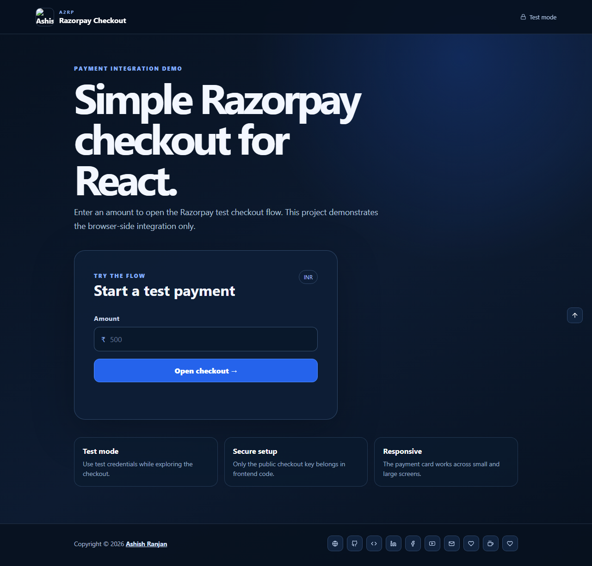

# React Razorpay Checkout

A focused React demo for opening the Razorpay test checkout with a validated INR amount.

## Features

- INR amount validation
- Razorpay test checkout integration
- Payment success and dismissal status
- Responsive fixed header, footer, and local branding
- Icon-only external and support links

## Tech stack

React, Create React App, Razorpay Checkout, and React Icons.

## Run locally

~~~bash
npm install
npm start
~~~

Build and deploy:

~~~bash
npm run build
npm run deploy
~~~

This demo uses Razorpay test mode. A backend is required for a production payment flow and signature verification.

## Links

- Live: [https://a2rp.github.io/reactjs-razorpay/](https://a2rp.github.io/reactjs-razorpay/)
- Repository: [https://github.com/a2rp/reactjs-razorpay](https://github.com/a2rp/reactjs-razorpay)
- Portfolio: [https://www.ashishranjan.net/](https://www.ashishranjan.net/)
- GitHub: [https://github.com/a2rp](https://github.com/a2rp)
- CodePen: [https://codepen.io/ash1198](https://codepen.io/ash1198)
- LinkedIn: [https://www.linkedin.com/in/aashishranjan](https://www.linkedin.com/in/aashishranjan)
- Facebook: [https://www.facebook.com/theash.ashish/](https://www.facebook.com/theash.ashish/)
- YouTube: [https://www.youtube.com/@ashishranjan-ashz?sub_confirmation=1](https://www.youtube.com/@ashishranjan-ashz?sub_confirmation=1)
- Email: [ash.ranjan09@gmail.com](mailto:ash.ranjan09@gmail.com)

## Support

- [Support](https://a2rp-donation-page.netlify.app/)
- [Buy Me a Coffee](https://buymeacoffee.com/a2rp)
- [Patreon](https://patreon.com/a2rp)
